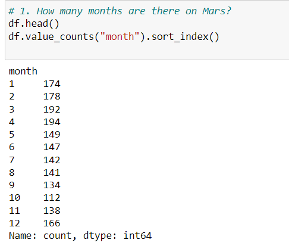
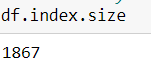
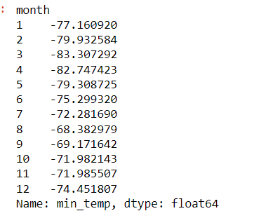
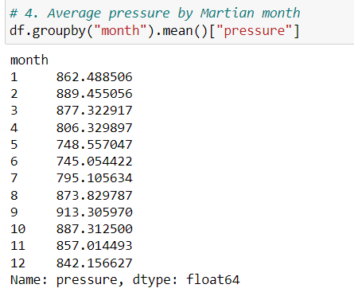
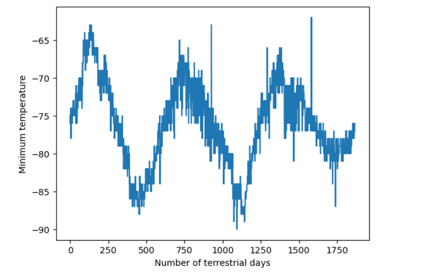

# How many months are there on Mars?
#According to my count, there are 12 months that exist on Mars. The biggest month is the fourth month is about 194 days while the smallest one is the 10th month, which contains about 112 days.

# How many Martian (and not Earth)days worth of data exist in the scraped dataset?
#There are 1867 Martian days worth of data that exist in the scraped dataset.   
   
# What are the coldest and the warmest months on Mars (at the location of Curiosity)?    
#The coldest month are Mars is the third month, while the warmest month is the eighth month, that is clearly shown by the bar chart. The coldest month has about -83.307292 degrees while the warmest month has about -68.382979 degrees. The plot chart below supports my answer.    
    
# Which months have the lowest and the highest atmospheric pressure on Mars?     
#Concerning the atmospheric pressure, the lowest is in the sixth while the highest is in the ninth. The sixth has about 745.054422 while the ninth has about 913.305970.     
 
# About how many terrestrial (Earth) days exist in a Martian year?    
#From the plot, the year on Mars appears to be about 675 days from the plot. Mars year is equivalent to 687 earth days.     
 
